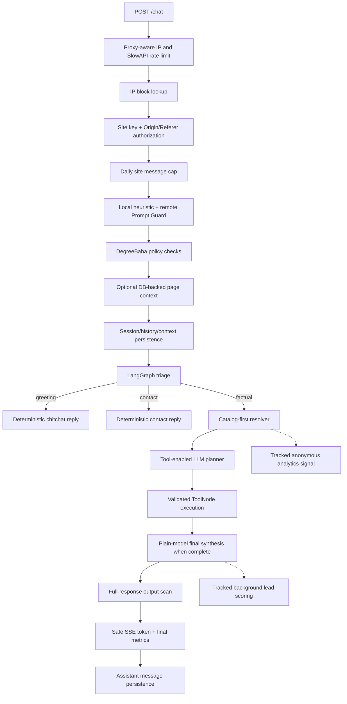

# DegreeBaba Backend Production Audit and Evidence-Based Remediation

Date: 2026-07-10  
Scope: `backend/main.py`, `backend/agent`, `backend/db`, `backend/security`, `backend/leads`, `backend/llm`, settings, observability, migrations, and tests.

## Executive verdict

The backend has a coherent production-oriented architecture: origin-bound site authorization, per-IP and per-site limits, layered input security, deterministic catalog resolution, a bounded LangGraph tool loop, parameterized catalog reads, persistent session/comparison context, lead capture, and detailed timing/cost instrumentation.

It is **not yet fully production-ready**. This audit fixed the issues that were directly reproducible without production infrastructure, including one critical output-security ordering flaw and one cross-site session isolation flaw. Remaining production readiness depends on deployment configuration validation, real database plans/row counts, analytics query correction, background-work capacity controls, and explicit CRM delivery semantics.

Evidence boundaries:

- Offline unit suite before remediation: **70 passed, 8 failed, 3 skipped**.
- Offline unit suite after remediation: **88 passed, 3 skipped**.
- The three skipped tests require Postgres on `localhost:5433`.
- The configured application database on `localhost:5432` was also unavailable.
- Therefore this audit contains no invented `EXPLAIN ANALYZE`, production latency, row-scan, pool-saturation, or hit-rate claims.

## 1. Architecture summary



### Component map

| Concern | Actual implementation |
|---|---|
| Authentication | Site key is tied to configured Origin/Referer domains. Admin routes use a constant-time Bearer-token comparison. |
| Rate limiting | SlowAPI uses the proxy-normalized client IP. `/chat`, lead, history, and widget settings have route limits. A DB-backed daily site cap supplements IP limits. |
| Prompt security | Local normalization/heuristics run first. Benign input is sent to Prompt Guard with two 2-second attempts, 100 ms backoff, and a circuit breaker. Local checks remain the outage fallback. |
| Policy | Deterministic regex checks cover identity attacks, prompt extraction, and competitor impersonation. |
| Resolver | Startup loads university/course/specialization search rows and canonical slugs. University detection is catalog-first with alias and constrained fuzzy matching. Course/spec snapping is hierarchically scoped. |
| Agent graph | Triage → optional resolver → ReAct agent → ToolNode → agent. Limits are 4 tool rounds and 8 actual calls per turn. Successful tool batches use a no-tools synthesis pass. |
| Tools | Eleven catalog tools. Slugs are format checked and DB verified. Comparison validation is batched. Query columns and entity tables are allowlisted. |
| Database | One asyncpg pool, maximum 10 connections. Queries are parameterized except allowlisted identifiers/order expressions. Migrations run during startup. |
| Sessions | Messages, entity context, and structured comparison context are stored in Postgres. Agent history is capped at eight user/assistant messages. |
| Leads | Contact intent can trigger the form synchronously. Lead records are local DB writes with optional CRM forwarding. Score and semantic intent work runs in the background. |
| Analytics | Message-level timing, token, cost, and tool data are persisted. Admin routes expose model, tool, university, funnel, cost, lead, and security analytics. |
| Background jobs | Anonymous signals and post-response lead scoring are in-process asyncio tasks. Active tasks are now strongly referenced until completion. |
| `backend/utils`, `backend/models` | These requested scope directories do not exist in the current repository. |

## 2. Real request trace: “Compare NMIMS and Amity MBA”

### Resolver evidence

A controlled warm-cache run returned:

```text
university_slug: nmims-online
course_slug: nmims-online-mba
comparison_targets: [nmims-online, amity-university-online]
resolution_status: resolved
comparison_found: [nmims-online, amity-university-online]
comparison_missing: []
mention_type: comparison
```

This confirms comparison preservation. The single `course_slug` is the primary university's course; the resolver does not manufacture an Amity course slug. Which comparison tool is selected remains an LLM decision. That limitation is reported, not changed.

### Stage trace

| Stage | Purpose and output | Dependencies and calls | Failure behavior |
|---|---|---|---|
| IP and site checks | Reject blocked clients, invalid keys, and mismatched origins | Up to 2 DB reads: IP block and daily cap | HTTP 403/429 before SSE begins |
| Prompt Guard | Local attack score, then remote score for locally benign input | 1 remote call, at most 2 attempts | Local heuristic fallback; circuit opens after repeated terminal failures |
| Policy | Reject DegreeBaba identity/prompt attacks | No external/DB call | Safe fixed response; security records are written |
| Page context | Resolve pathname slugs and names | 0 calls when pathname absent; otherwise 1–3 serial DB reads | Empty page context on lookup failure |
| Session setup | Authorize session ownership, load history/context, persist user input | 3 reads and 3 writes after remediation: history/context plus user insert/session counter and session upsert | Cross-site UUID reuse is rejected atomically |
| Resolver | Detect both universities, snap primary MBA, persist single and comparison context | Warm cache uses no resolver read; comparison persistence uses 2 writes | Partial/unknown entities receive explicit advisory state |
| Planner | Select the comparison tool | 1 main-agent LLM call with tools | Safe agent error reply on provider failure |
| Tool execution | Validate slugs and fetch comparison rows | Normal comparison path: 1 batch validation read + 1 comparison read | Uniform `not_found` envelope; failed/incomplete batches retain tool access |
| Synthesis | Format the tool result | 1 main-agent LLM call without schemas after a complete batch | Tool access remains available when results were not complete |
| Output security | Scan the complete generated response | Local regex scan; flagged output adds 1 DB write | Unsafe content is replaced before its first client-visible token |
| Persistence | Store assistant reply and observability | 2 writes: message insert and session counter update | Stream exception fallback in `main.py` |
| Background lead work | Score signals and run semantic lead classifier | For this text: 1 DB score read, 1 background LLM call, 1 status write | Exception is logged; response data is unaffected |

For a normal request with a client IP, no page pathname, warm cache, one successful comparison tool, and no failure branches, the foreground path is approximately **6 reads + 7 writes = 13 DB statements** after remediation. It was 14 because `ensure_session` performed a blank `session_context` insert every turn. The exact production cost cannot be stated without live traces and query plans.

## 3. Findings and implemented fixes

### Critical — output scanning occurred after client emission

**Evidence:** `run_chat_turn` yielded both model chunks and assembled replies before calling `scan_output`. An unsafe reply could therefore reach the browser even though the persisted copy was later replaced.

**Impact:** System-prompt, configuration, or identity leakage patterns detected by the output scanner were not actually blocked at the response boundary.

**Fix:** `backend/agent/graph.py`, `run_chat_turn` now buffers model output, scans the complete reply, records the correct risk reason, and only then emits the first SSE token. The previously un-emitted unanswered fallback is also emitted through this same safe path.

**Measured before/after:** unsafe client tokens: possible before, zero in the regression test after. LLM and graph transition counts are unchanged. Risk: token-event granularity is now intentionally buffered; local scan overhead is negligible but production TTFT must be observed.

### High — site authorization did not extend to session ownership

**Evidence:** `ensure_session` accepted an existing UUID without comparing `sessions.site_id`; public history selected solely by session UUID; lead capture attached to any existing session UUID.

**Impact:** A session identifier reused or obtained across configured sites could mix messages, expose history, or misattribute a lead across tenants.

**Fixes:**

- `backend/db/queries.py`, `ensure_session`: conditional atomic upsert rejects a conflicting site.
- `backend/db/queries.py`, `get_session_history`: optional site predicate joins `sessions`.
- `backend/main.py`, `session_history`: passes the authorized site key.
- `backend/agent/tools.py`, `capture_lead`: atomic site-aware session upsert.
- `backend/main.py`, `lead_webhook`: returns 403 for a site mismatch.

**Risk:** Clients that incorrectly reuse a session UUID across sites are now rejected, which is the intended authorization behavior.

### High — lead endpoint reported success after local capture failure

**Evidence:** `capture_lead` converts exceptions into a `not_found` failure envelope, but `lead_webhook` ignored the return value and always returned `{"ok": true}`.

**Impact:** The widget could tell a user that a lead was captured when no row existed.

**Fix:** `lead_webhook` returns 503 for local capture failure and 403 for session/site mismatch. CRM delivery semantics are separately deferred below.

### Medium — common follow-up was classified as an unknown university

**Evidence:** `_count_intended_universities("what's the fee?")` returned 1 because punctuation normalization produced `whats`, which was not a stop word. A live resolver probe returned `entity_not_found` instead of applying saved NMIMS context.

**Impact:** A common conversational follow-up lost session context and produced the wrong user path.

**Fix:** `backend/agent/resolve.py` blocks `whats` from university-name inference. The same probe now returns `session_context`, `nmims`, and `online-mba`.

### Medium — pronoun “it” was treated as an IT specialization

**Evidence:** `extract_intent("How much does it cost?")` and `extract_intent("Is it eligible?")` returned `specialization_query="it"`. With a cold cache this triggered a database fallback; with an IT specialization present it could snap the wrong entity.

**Impact:** Extra DB work and potentially incorrect specialization context on ordinary follow-ups.

**Fix:** Bare lowercase `it` is no longer an entity. Uppercase `IT`, `information technology`, or explicit phrases such as `IT specialization` remain supported.

### Medium — scheduled background work had no strong task reference

**Evidence:** Lead scoring and anonymous signals used bare `asyncio.create_task`. Python's event loop keeps weak task references; the documented safe fire-and-forget pattern retains tasks until completion.

**Impact:** Analytics/lead work could disappear before completion, and lead-scoring tasks were not centrally observed.

**Fix:** `backend/agent/graph.py` tracks active tasks in a set, removes them on completion, logs unexpected failures, and preserves response independence.

### Medium — tool failures were recorded as successes

**Evidence:** `timed_tool_execution` marked only raised exceptions as `FAILURE`. Tools deliberately return `{"not_found": true}` instead of raising, so validation failures and missing data inflated success rates.

**Impact:** The admin tool-success dashboard was misleading.

**Fix:** `backend/observability.py` classifies uniform failure envelopes as `FAILURE`.

### Medium — DeepSeek configuration selected Groq model names

**Evidence:** provider validation and client construction supported `deepseek`, but `PROVIDER_MODELS` did not. The fallback selected `llama-3.3-70b-versatile` and sent it to the DeepSeek endpoint.

**Impact:** `PROVIDER=deepseek` could start successfully and then fail model calls.

**Fix:** `backend/llm/config.py` maps both DeepSeek tasks to `deepseek-chat`.

### Low — blank session-context write on every turn

**Evidence:** `ensure_session` inserted `session_context(session_id)` with `ON CONFLICT DO NOTHING` on every turn. Reads already return `{}` for no row, and both context writers are upserts.

**Impact:** One guaranteed Neon round trip per request with no answer or persistence benefit.

**Fix:** Removed the blank insert. `ensure_session` now performs one write rather than two. Regression test asserts one write.

### Low — canonical university validation queried existence twice

**Evidence:** `validate_university_slug` called `normalize_university_slug`, whose canonical path queried `universities`, and then queried the same canonical slug again.

**Impact:** One unnecessary database round trip for every canonical university tool argument.

**Fix:** Reused the existing batch candidate validator for single university validation. Canonical, original, and brand-head candidates are checked in one read. Regression test asserts one existence query.

### Low — public history accepted a negative SQL limit

**Evidence:** `get_session_history` applied only `min(limit, 50)`, allowing negative values to reach PostgreSQL `LIMIT` and fail the request.

**Fix:** History limits are clamped to the inclusive range 1–50.

## 4. Database report

### Verified current behavior

- Pool: asyncpg, minimum 1 and maximum 10 connections; managed hosts require SSL.
- Session/message writes are separate statements and not wrapped in one transaction. Partial persistence is possible, but the current fallback behavior is deliberate and no corruption was reproduced.
- Comparison validation is already batched: N slugs → 1 validation read, then 1 comparison read.
- Warm resolver cache now contains canonical course/spec slugs, so normal snaps do not query ID → slug.
- Dynamic table names and selected fields are allowlisted. Course ordering expressions are allowlisted. Values remain parameterized.
- No database N+1 was found in the normal comparison tool after the existing batch-validation remediation.

### Proven or suspicious waste left unchanged

1. `insert_message` performs an insert and a separate session counter update. Combining them would change transaction/failure semantics; no production timing justified that change.
2. Comparison resolution persists single context and comparison context in two writes. Combining them would require a query contract change; no latency trace justified it.
3. `resolve_page_context` performs up to three serial reads. This occurs only when a pathname is supplied and no production distribution or timing was available.
4. `run_migrations` deliberately replays consolidated `0001_init.sql` at every startup so later `ALTER ... IF NOT EXISTS` additions are applied. It is proven startup work, but skipping it would break the repository's current migration strategy.
5. Daily message cap, analytics overview, costs, and security summary issue multiple queries. They require production plans/row counts before consolidation.

### Analytics correctness requiring follow-up

`get_analytics_universities` and `get_analytics_funnel` join sessions, messages, and leads before summing message cost. Sessions with multiple leads can multiply message rows and overstate cost/tokens. This is relationally visible in the SQL, but the intended definition of “conversion” and production fixture data were unavailable. The query was not changed without that product/DB evidence.

## 5. Resolver report

Verified:

- University aliases are canonical and distinctiveness-filtered.
- Exact and constrained fuzzy catalog scans preserve canonical IDs/slugs.
- Course and specialization snapping is scoped by university/course before global fallback.
- Unknown and partial comparison targets are explicit states; tools are suppressed for partial comparisons.
- Structured comparison context persists and supports pronoun follow-ups.
- Controlled NMIMS/Amity trace preserved both comparison targets.

Deferred:

- A two-university MBA request resolves only the primary university's course slug. The LLM can compare university-level fields, but exact course-vs-course comparison requires two explicit course slugs. No incorrect production answer or tool trace was supplied, and changing this would redesign resolver business logic.
- Cache refresh replaces entity types sequentially. A concurrent request could observe a mixed cache generation, but no incident or refresh concurrency evidence exists.

## 6. Agent and tool report

Verified:

- Graph states are reachable and termination is explicit.
- Tool-round cap: 4. Actual per-turn tool-call cap: 8.
- Excess tool calls are truncated and followed by tool-free synthesis.
- Complete batches synthesize without the 11-tool schema; failures retain tools.
- Corrected tool arguments replace the original AI message by ID, avoiding duplicate history.
- Tool errors use one failure envelope and do not crash the graph.

Deferred:

- The main model timeout is 60 seconds. No timeout incident distribution justified lowering it.
- Tool execution has no explicit per-query statement timeout. This is a production reliability risk, but requires database SLOs and query plans.
- Planner model chunks from multiple ReAct passes are buffered into `reply_text`. Current tools normally emit empty planner content; no duplicate-content case was reproduced.

## 7. Security report

Verified protections:

- Site keys are bound to their configured domains, including wildcard suffix handling.
- Missing Origin/Referer is rejected on site-key routes.
- Proxy wildcard trust is rejected, preventing trivial forwarded-IP spoofing.
- Admin auth uses `hmac.compare_digest`.
- Local prompt heuristics cannot be disabled by remote Prompt Guard failure.
- Prompt Guard retries, timeout, fallback, and circuit behavior are tested.
- Tool slugs are format checked and catalog verified; dynamic SQL identifiers are allowlisted.
- Output scanning now precedes response emission.
- Session history, chat persistence, and lead capture are site scoped.

Deferred risks:

1. `ADMIN_AUTH_TOKEN` defaults to `change-me`, and startup does not reject that value. Production environment configuration was unavailable, so this was not changed blindly. Deployment must set and rotate a strong token.
2. `/widget/config` permits a request with neither Origin nor Referer, despite its docstring claiming validation. Returned data is global public widget configuration, not credentials; whether non-browser access should be forbidden is a product decision.
3. Security-event country lookup sends IPs to `http://ip-api.com` and can add up to one second on a block path. Privacy and provider requirements were not available.
4. Invalid UUID strings can reach Postgres casts on history/admin paths. Typed request validation should be added once public error compatibility is defined.

False positives rejected:

- No SQL injection was found in catalog sorting/table selection: interpolated values come from hard allowlists.
- No infinite graph loop was found: both rounds and actual calls are capped.
- No duplicate LangGraph execution was found: the final `LangGraph` event is authoritative; fallback runs only when that event is absent.
- No comparison-target loss was reproduced for NMIMS and Amity.
- No claim is made that pool size 10, history size 8, or the current indexes are wrong without production concurrency/plans.

## 8. Reliability and background report

Verified recovery:

- Prompt Guard falls back locally and opens a circuit after repeated terminal failures.
- Agent failures return a safe generic answer.
- Tool wrappers convert exceptions to safe failure envelopes.
- Cache warmup failure allows startup and resolver DB fallback.
- Pool initialization retries five times and fails startup explicitly.
- Active analytics tasks are now retained and observed.

Remaining risks:

- Lead-scoring launches one background LLM classifier per completed turn with no concurrency limit. There is no production throughput evidence, so a semaphore/worker was not introduced.
- Process shutdown closes the DB pool but does not drain active background tasks.
- `/health` is a liveness response only; it does not verify DB, Prompt Guard configuration, or cache readiness.
- Optional CRM forwarding is synchronous, lacks idempotency, and does not call `raise_for_status`; the definition of successful capture versus successful CRM delivery must be established before changing retries/status codes.
- Session, user message, and assistant message persistence are not one transaction. This favors retaining partial conversation evidence but must be accepted explicitly.

## 9. Confirmed dead code and unused state

The following have no runtime caller in the repository. They were reported rather than deleted because compatibility/data-retention requirements are unknown:

- `backend/agent/guardrail.py` and `OFF_TOPIC_REDIRECT`.
- `agent.resolve.snap_university`.
- `agent.llm_client.LLMClient.generate_text`.
- `llm.provider.stream` (the similarly named evaluation-client method is unrelated).
- `security.tool_validator.normalize_university_slug` after the validation-chain fix.
- `db.queries.get_security_summary`, superseded by `get_security_events_summary`.
- `db.queries.list_widget_settings`; admin routes call `get_widget_settings` directly.
- `_AUTO_BAN_WINDOW_HOURS`.
- `ChatState.cache_hit` and its route/assembly branches: the triage node always sets it to false and labels it as future work.
- `sessions.summary`: selected by admin conversation listing but never populated or consumed by the agent.

Runtime catalog reads do not use `reviews`, `job_profiles`, `highlights`, `fee_plans`, `faculty_members`, `accreditations`, `facts`, `other_specs`, or `content_chunks`. Most are still written by ingestion/seed scripts, so they are **write-only from the production backend**, not safe-to-drop tables. `faqs` is not dead despite the migration comment: `get_faq_tool` reads it.

## 10. Files changed

| File | Function/area | Reason | Expected impact | Risk |
|---|---|---|---|---|
| `backend/agent/graph.py` | response assembly, background scheduling | Scan before emit; retain tasks | Blocks real output leaks; reliable analytics tasks | Buffered token emission |
| `backend/agent/resolve.py` | `_local_extract`, university intent blocklist | Fix `it` and `what's` follow-ups | Correct context; avoids false DB/spec lookup | Bare lowercase “it” now requires context |
| `backend/agent/tools.py` | `capture_lead` | Atomic site ownership | Prevents cross-site attribution | Rejects invalid reused UUIDs |
| `backend/db/queries.py` | `ensure_session`, `get_session_history` | Site isolation; remove no-op write; clamp limit | Prevents mixing/invalid limits; one fewer write/turn | None for valid sessions |
| `backend/security/tool_validator.py` | `validate_university_slug` | Remove duplicated existence query | One read instead of two | Candidate-order behavior preserved |
| `backend/observability.py` | `timed_tool_execution` | Correct failure metrics | Accurate tool dashboard | Metrics-only |
| `backend/llm/config.py` | provider registry | Correct DeepSeek model | Makes configured provider usable | No effect on other providers |
| `backend/main.py` | lead/history routes | Surface capture failure; site scope | Honest response and tenant isolation | Explicit 403/503 responses |
| `tests/test_graph.py`, `tests/test_units.py` | fixtures and regression tests | Match startup cache contract; prove fixes | 88 passing tests | Test-only |

## 11. Performance before and after

Only directly countable changes are reported:

| Path | Before | After |
|---|---:|---:|
| Session ensure | 2 writes/turn | 1 write/turn |
| Canonical university validation | 2 existence reads | 1 existence read |
| Comparison validation | 1 read for all slugs (already present) | unchanged |
| Planner/synthesis LLM calls | normally 2 | unchanged |
| Graph transitions | unchanged | unchanged |
| Output-security exposure | reply could emit before scan | scan completes before first token |

No percentage latency claim is made because Neon and provider timing data were unavailable.

## 12. Top remaining risks and future work

### Top five remaining risks

1. Production can start with the default admin token unless deployment overrides it.
2. Analytics university/funnel costs can be multiplied by message × lead joins.
3. Background lead-classifier concurrency and shutdown draining are unbounded/unmanaged.
4. CRM delivery success, HTTP failure handling, retry, and idempotency semantics are undefined.
5. No real database plans, statement-timeout policy, or dependency-aware readiness check were available.

### Top five evidence-gathering improvements

1. Reject default admin credentials in production and expose non-secret readiness flags for DB/cache/Prompt Guard.
2. Capture `EXPLAIN (ANALYZE, BUFFERS)` for daily cap, history, catalog reads, admin lists, and analytics on production-like row counts.
3. Define conversion and CRM-delivery semantics, then preaggregate analytics and add idempotent lead delivery.
4. Measure background classifier concurrency/cost and add an in-process bound only if saturation is observed.
5. Add valid/invalid UUID request tests and explicit statement/LLM timeout SLOs.

### What should not be changed now

- Do not rewrite LangGraph or the tool framework.
- Do not add Redis, queues, or new infrastructure without measured need.
- Do not restore pre-scan token streaming; the scanner requires the full response.
- Do not remove Prompt Guard, local heuristics, tool validation, or the circuit breaker.
- Do not redesign comparison resolution without an answer-quality corpus proving failure.
- Do not drop write-only catalog tables until ingestion and product owners confirm their retention requirements.
