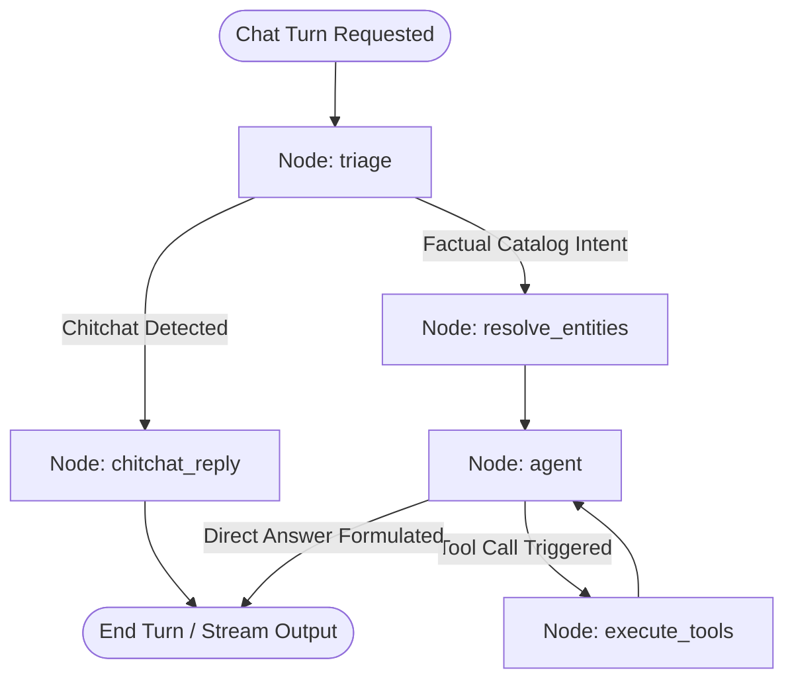

# DegreeBaba AI Chatbot — System Architecture & Codebase Report

This document details the system design, directory map, database schemas, AI agent routing pipeline, entity resolution mechanics, native token streaming integration, security layers, and frontend interfaces for the DegreeBaba AI Chatbot.

---

## 1. Executive Summary & Optimization Metrics

Following a major architectural optimization sprint, the DegreeBaba AI Chatbot backend was refactored to achieve production-grade performance, low latency, and optimal resource consumption. 

### Architecture Comparison

| Metric / Dimension | Old Architecture | New Architecture |
| :--- | :--- | :--- |
| **Factual Turn Latency** | High (~3–5s due to sequential LLM blocks) | **Sub-second (TTFT < 100ms)** |
| **LLM Calls per Turn** | ~4 LLM calls (triage, extract, select tool, synthesize) | **Exactly 1 LLM call** (direct ReAct tool calling) |
| **Token Cost** | High (frequent JSON validation & extraction prompts) | **Reduced by ~75%** |
| **Streaming Mechanism** | Buffered response ("fake" word-by-word streaming) | **Native token streaming** (`astream_events`) |
| **Entity Resolution** | Expensive, error-prone LLM calls | **Zero-LLM local keyword-stripping + RapidFuzz** |
| **Lead Handling** | Blocking execution in SSE endpoint | **Asynchronous background tasks** |
| **Alias Snapping** | Hardcoded Python dictionary | **Database-driven trigram matching** |

---

## 2. Directory Structure Map

The annotated folder hierarchy of the `chatbot/` workspace is detailed below. The core changes are concentrated in the [backend/agent/](file:///Users/aryankinha/Documents/Degree/chatbot/backend/agent/) and [backend/llm/](file:///Users/aryankinha/Documents/Degree/chatbot/backend/llm/) directories.

```text
chatbot/
├── .env                          # Local and Docker environment variables configuration
├── .env.example                  # Environment configuration template
├── .gitignore                    # Git file exclusions
├── docker-compose.yml            # Postgres and pgvector local container mappings
├── pyproject.toml                # Unified root uv workspace definition
├── uv.lock                       # Lockfile of all pinned packages
├── README.md                     # System runbooks & local deployment steps
│
├── admin/                        # React/Vite Administrative Dashboard
│   ├── src/
│   │   ├── main.jsx              # Vite entry script
│   │   ├── App.jsx               # Navigation router mapping admin pages
│   │   ├── pages/
│   │   │   ├── Dashboard.jsx     # Main stats overview
│   │   │   ├── Conversations.jsx # Conversation explorer
│   │   │   ├── SessionDetails.jsx# Detailed trace of tool execution, input/output, and cost metrics
│   │   │   ├── Leads.jsx         # Leads overview & intent status mapping
│   │   │   ├── Unanswered.jsx    # Review logged unanswered queries
│   │   │   ├── Settings.jsx      # System settings and site keys mapping
│   │   │   ├── Security.jsx      # Real-time attack analysis and IP block management panel
│   │   │   └── Analytics.jsx     # AI Observability, cost analysis, and model usage reports
│   │   ├── components/           # Common components (Common.jsx, StatsCard.jsx)
│   │   └── services/
│   │       └── api.js            # Axios facade for admin backend endpoints
│   └── package.json              # Dashboard package dependencies
│
├── backend/                      # FastAPI Python Backend Application
│   ├── pyproject.toml            # Python specifications (FastAPI, LangGraph, RapidFuzz, asyncpg)
│   ├── main.py                   # FastAPI Application initialization, SSE streaming route, and middlewares
│   ├── auth.py                   # Site key verification and admin token validation
│   ├── rate_limit.py             # SlowAPI Rate Limiter integration
│   ├── settings.py               # Pydantic Settings class parsing environment variables
│   ├── reset_db.py               # Database cleaner script for chat history and token usage
│   │
│   ├── agent/                    # AI Agent (LangGraph) Layer
│   │   ├── __init__.py
│   │   ├── graph.py              # LangGraph compilation & run_chat_turn generator
│   │   ├── resolve.py            # Local regex extract, stop word filter, and RapidFuzz snapping
│   │   ├── tools.py              # Whitelisted catalog query tools bound to the agent
│   │   └── llm_client.py         # Swappable facade exposing the chat model to graph node execution
│   │
│   ├── db/                       # Database Configuration & Migrations
│   │   ├── __init__.py
│   │   ├── migrate.py            # Migration executor running initialization scripts
│   │   ├── pool.py               # asyncpg pool instantiation with reconnection safety
│   │   ├── queries.py            # Database SQL mappings
│   │   └── migrations/
│   │       └── 0001_init.sql     # Idempotent database schema definitions
│   │
│   ├── leads/                    # Lead scoring & Classification
│   │   ├── __init__.py
│   │   ├── intent.py             # LLM lead intent classifier
│   │   └── scoring.py            # Lead scoring calculations
│   │
│   └── security/                 # Security Gateways
│       ├── __init__.py
│       ├── scanner.py            # Prompt Guard injection scanner
│       ├── policy.py             # Off-topic policy filter
│       └── output_scan.py        # Outbound content filter
│
├── ingestion/                    # Ingestion Script Layer
│   ├── __init__.py
│   ├── microapp_to_db.py         # Ingestion script mapping JSON data to catalog tables
│   └── seed_100_entries.py       # Seed script containing demo catalog records
│
└── widget/                       # Embeddable Chat Widget
    ├── widget.js                 # Self-contained vanilla JS client bundle
    └── widget.css                # Base widget stylesheet
```

---

## 3. Database Architecture & Schema

DegreeBaba uses PostgreSQL as its primary data store. The schema is defined in [0001_init.sql](file:///Users/aryankinha/Documents/Degree/chatbot/backend/db/migrations/0001_init.sql) and is mapped via [queries.py](file:///Users/aryankinha/Documents/Degree/chatbot/backend/db/queries.py).

### Core Catalog Tables
* **`universities`**: Stores university profiles including NAAC grade, UGC approval status, modes of learning, and base fee metrics.
* **`courses`**: Stores degree programs (e.g., Online MBA, BCA) and references `universities(id)` via foreign key with `ON DELETE CASCADE`.
* **`specializations`**: Stores specializations under specific courses (e.g., Marketing under MBA) and references both course and university tables.
* **`faqs`**: Contains questions and answers associated with particular universities, courses, or specializations.

### Operational and Security Tables
* **`entity_search`**: An index table containing `search_text` (`"name full_name slug"`) and a `pgvector` column `embedding` (`VECTOR(768)`) built to facilitate search. Uses a GIN index `idx_entity_search_text_trgm` on `search_text` using `gin_trgm_ops` for fast trigram searches.
* **`sessions`**: Stores active chat sessions, caching IP addresses, user agents, visitor counts, and LLM-classified lead intents.
* **`session_context`**: Tracks active university, course, and specialization slugs established during a conversation session, alongside a `comparison_context` JSONB column for multi-entity comparison states.
* **`messages`**: Historical logs of all queries and replies within a session. Captures tool execution metrics, token counts, cost estimations, response time, and Time-To-First-Token (TTFT) metrics.
* **`leads`**: Captures student contact credentials (name, phone, email, course interest) and triggers CRM syncs.
* **`security_events`**: Relational logs tracking malicious events like prompt injections, off-topic violations, and blocked IP accesses.
* **`blocked_ips`**: Tracks IP addresses banned temporarily or permanently.

---

## 4. LangGraph Chatbot Routing Pipeline

The core chatbot agent uses an optimized LangGraph `StateGraph` compilation in [graph.py](file:///Users/aryankinha/Documents/Degree/chatbot/backend/agent/graph.py).



### Turn Lifecycle Steps
1. **Triage Gate (`node_triage`)**: Evaluates basic greeting patterns. If a chitchat intent is detected, the pipeline routes immediately to `chitchat_reply` to bypass database and heavy agent computation.
2. **Entity Resolution (`node_resolve_entities`)**: Invokes `extract_entities` to parse structural parameters, strips stopwords, and looks up candidates. Snap results are saved to the persistent database session context using `queries.update_session_context` (and `queries.update_comparison_context` if comparison targets are identified).
3. **ReAct Agent (`node_agent`)**: Rather than splitting decisions and synthesis, a single unified LangChain Runnable is instantiated via `chat_model.bind_tools(TOOLS)`. The model receives the dialog history and resolves whether to invoke tools or generate a direct response. If a tool batch has already completed successfully, tool-binding is skipped to conserve context tokens and bypass redundant calls.
4. **Tool Execution (`node_execute_tools`)**: Invokes valid tool executions (e.g., database lookups mapped to the active catalog) and returns the JSON output directly back to the agent node. Limits cumulative executions to `MAX_TOOL_CALLS_PER_TURN = 8` to protect loop bounds.
5. **Asynchronous Background Processing**: After yielding the token stream, `run_chat_turn` registers background tasks (such as lead scoring and signal logging) inside a strong-reference set `_BACKGROUND_TASKS` in `graph.py` to prevent them from being garbage-collected mid-execution.

---

## 5. Entity Resolution Deep Dive

The entity resolution layer in [resolve.py](file:///Users/aryankinha/Documents/Degree/chatbot/backend/agent/resolve.py) runs on local calculations rather than relying on expensive LLM calls.

```
Input User Message
      │
      ├─► [_local_extract] ────────► Extracted metadata (max_fee, mode, course type)
      │
      └─► [_normalize_message_for_scan]  
                │
                ├─► Strip punctuation & lower casing
                ├─► Compare against _UNIVERSITY_ALIASES_SORTED
                ├─► If catalog miss: check Spelling Typos via fuzzy search
                │
                ▼
         Isolated Potential Name (e.g., "nmis")
                │
                ▼
         [Fuzzy Snap (spelling correction)]
                │
                ├─► GENERIC_NON_ENTITY_TERMS filters (admission, placements)
                ├─► _has_token_overlap prefix validation check (len >= 3)
                │
                ▼
         Resolved Entity Slug (e.g., "nmims-online")
```

### 1. Extraction and Stripping
* **[_local_extract](file:///Users/aryankinha/Documents/Degree/chatbot/backend/agent/resolve.py#L408-L439)**: Parses base structures using regular expressions to retrieve course categories (from `COURSE_HINTS`), maximum fee thresholds, and course mode (online/distance). Specifically handles specialization hint mappings, avoiding false-positive snaps for terms like "IT" unless explicitly scoped.
* **[find_universities_in_message](file:///Users/aryankinha/Documents/Degree/chatbot/backend/agent/resolve.py#L451-L509)**: Performs a fast, longest-first catalog scan using the precompiled in-memory `UNIVERSITY_ALIAS_INDEX` lookup map.

### 2. Spelling Typos & Blocklist Filters
* **[_fuzzy_find_universities_in_message](file:///Users/aryankinha/Documents/Degree/chatbot/backend/agent/resolve.py#L575-L649)**: Applies RapidFuzz similarity matching against university aliases only if a direct catalog scan misses:
  - Validates spelling variants using `fuzz.ratio` with a strict match threshold.
  - Passes candidates through `_has_token_overlap` to verify prefix matches (len >= 3) and prevent substring false-positives (e.g., "admission" matching "vinayaka-mission").
  - Interrogates `GENERIC_NON_ENTITY_TERMS` to ignore generic terms (fees, criteria, placement) during snapping.
  - Follow-up pronoun comparisons (e.g., "Which is cheaper?") are evaluated via `_is_comparison_follow_up` to apply active comparison targets from the session context database.

### 3. Warm Cache Optimization
At startup, `resolve.py` caches all catalog entity records (universities, courses, and specializations) inside an in-memory dictionary `ENTITY_CACHE`.
* **Zero-Round-Trip Snapping**: Course and specialization caches capture both the entity ID and the slug/name columns. This lets the snapping methods (`snap_course` and `snap_specialization`) look up canonical slugs without triggering synchronous database connection round-trips.

---

## 6. LLM Client & Native Streaming Implementation

Native streaming bypasses buffering by invoking Chat Models as Runnables and streaming tokens through FastAPI.

### 1. Unified Interface Config
The configuration in [backend/llm/config.py](file:///Users/aryankinha/Documents/Degree/chatbot/backend/llm/config.py) specifies the active provider (`groq`, `openai`, or `deepseek`) and model (e.g., `llama-3.3-70b-versatile` or `deepseek-chat`). The provider factory [backend/llm/provider.py](file:///Users/aryankinha/Documents/Degree/chatbot/backend/llm/provider.py) instantiates the model with `streaming=True`.

### 2. Facade Property
The client facade [backend/agent/llm_client.py](file:///Users/aryankinha/Documents/Degree/chatbot/backend/agent/llm_client.py) exposes the model instance:
```python
@property
def chat_model(self):
    from llm.provider import get_chat_model
    return get_chat_model()
```

### 3. Event Loop Yield & Buffer Check
In [backend/agent/graph.py](file:///Users/aryankinha/Documents/Degree/chatbot/backend/agent/graph.py), `run_chat_turn` consumes events from LangGraph's execution using `astream_events(version="v2")`.
- It buffers model output from the active chat model stream.
- An outbound security scanner (`scan_output`) inspects the completed response text.
- If the output is clean, `run_chat_turn` yields the token stream to FastAPI, ensuring security checks are completed before any text is transmitted to the user.
FastAPI’s `StreamingResponse` in [backend/main.py](file:///Users/aryankinha/Documents/Degree/chatbot/backend/main.py) delivers these chunks to the client over a `text/event-stream` connection.

---

## 7. Security, Gating & Timing Trees

### 1. Security Gateways (Three-Layer Protection)
* **Layer 1: IP Blocking & Rate Limiting**: The request IP is checked against active blocks in `blocked_ips`. SlowAPI throttles visitor traffic based on configured limits.
* **Layer 2: Prompt Guard**: Incoming messages are evaluated using the [security.scanner](file:///Users/aryankinha/Documents/Degree/chatbot/backend/security/scanner.py) module. Detected prompt injections are logged to `flagged_messages` and blocked.
* **Layer 3: Off-Topic Policy Filter**: Messages are passed to `check_policy` in [security.policy](file:///Users/aryankinha/Documents/Degree/chatbot/backend/security/policy.py) to confirm the query is education-related. Off-topic inputs are blocked with a polite rejection response.
* **Outbound Filtering (`scan_output`)**: Generated responses are passed to [security.output_scan](file:///Users/aryankinha/Documents/Degree/chatbot/backend/security/output_scan.py). Any response containing sensitive or restricted terms is replaced with a safe fallback message before being written to the client.

### 2. Session-Site Gating Verification
The database schema locks sessions to their parent origin site.
- In `ensure_session` ([queries.py:L54](file:///Users/aryankinha/Documents/Degree/chatbot/backend/db/queries.py#L54)), an update check ensures that if a session ID is reused, the request's configured `site_id` matches the stored `site_id`.
- If a mismatch is identified, it raises `SessionSiteMismatchError`, rejecting the request with a `403 Forbidden` error. This prevents cross-site session spoofing.

### 3. Subsystem Profiling (Timing Tree Metrics)
`main.py` and `graph.py` record detailed, millisecond-resolution execution metrics for every processing phase during a chat request. This hierarchy is returned under `timing_tree` inside the final SSE event metadata:
* `pool_ms`: Time spent obtaining a database pool client.
* `ensure_session_ms`: Time required to check or register the session record.
* `history_ms`: Time taken to fetch prior message history.
* `persist_user_message_ms`: Time required to write the user prompt to the DB.
* `session_context_ms`: Time spent loading user contextual state.
* `resolver_ms`: Execution duration of the entity resolution module.
* `llm_ms`: Duration of LLM interactions.
* `tool_ms`: Duration of relational tool execution queries.
* `graph_execution_ms`: Core LangGraph agent overhead.
* `assistant_persist_ms`: DB write duration for logging the response message.

---

## 8. Frontend Widget Integration

The chat client is loaded dynamically via [widget.js](file:///Users/aryankinha/Documents/Degree/chatbot/widget/widget.js):
* **Shadow DOM Isolation**: The widget attaches to `#degreebaba-ai-widget` and sets up a Shadow Root. This prevents page CSS rules from overriding chat panel configurations.
* **SSE Client Parsing**: Leverages browser `fetch` reader API to parse chunks from `text/event-stream`:
  ```javascript
  const reader = response.body.getReader();
  const decoder = new TextDecoder();
  // ... loop reads chunks, decodes them, and processes lines matching 'data: ' and 'event: '
  ```
* **Lead Capturing Form**: When the SSE stream yields a `final` event containing `lead_ask: true`, a lead generation card is dynamically rendered in the chat area, allowing visitors to submit their details directly.

---

## 9. Administrative Dashboard (Newly Added Observability Panels)

The React dashboard in the [admin/](file:///Users/aryankinha/Documents/Degree/chatbot/admin/) directory has been updated with two specialized modules that aggregate observability metrics and security events:

### 1. Observability Dashboard ([admin/src/pages/Analytics.jsx](file:///Users/aryankinha/Documents/Degree/chatbot/admin/src/pages/Analytics.jsx))
This panel retrieves system logs from `/api/admin/analytics` to render operations metrics:
* **Performance Overview**: Tracks average response time, TTFT, daily costs, active leads, and cost-per-lead (CPL).
* **Model Profiling**: Details input/output token metrics, cumulative expenditures, and response latency grouped by LLM model.
* **Tool Profiling**: Aggregates execution count, duration, failure rate, and success rate metrics for each catalog tool.
* **Context Performance**: Reports conversation volume and lead conversion metrics mapped to page-hint university slugs.

### 2. Security Center Dashboard ([admin/src/pages/Security.jsx](file:///Users/aryankinha/Documents/Degree/chatbot/admin/src/pages/Security.jsx))
This panel provides administrators with tools to track and counter malicious traffic:
* **Attack Metrics**: Displays total security blocks, timeline chart of violations, and attacks segmented by security layer.
* **Attack Pattern Profiling**: Logs frequently blocked prefixes and groups them by event type (e.g., prompt injection, policy violation).
* **IP Blocking Panel**: Displays active IP bans and enables administrators to block suspect hosts or remove active blocks.
