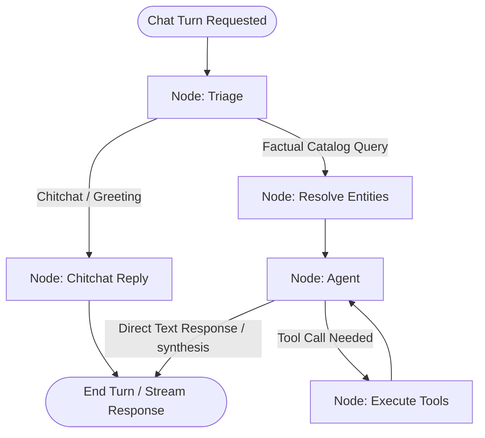

# DegreeBaba AI Chatbot — System Architecture & Codebase Report

This document details the full folder layout, database tables, AI routing pipeline, frontend design, and testing configuration for the DegreeBaba AI Chatbot.

---

## 1. Directory Structure Map

```text
chatbot/
├── .env                          # Current active environment configurations (local/docker)
├── .env.example                  # Documented environment template
├── .gitignore                    # Git file exclusions
├── docker-compose.yml            # Local Postgres container orchestration mapping
├── pyproject.toml                # Unified root uv workspace members declaration
├── uv.lock                       # Lockfile mapping all pinned package versions
├── README.md                     # System runbooks (Docker / Local / Test)
│
├── admin/                        # React/Vite Admin Dashboard
│   ├── src/                      # UI components, state management, and api requests
│   ├── index.html                # Entry HTML template
│   └── package.json              # Dashboard dependencies and build targets
│
├── backend/                      # FastAPI Backend Application Root
│   ├── pyproject.toml            # Python package specifications (fastapi, langgraph, groq)
│   ├── main.py                   # FastAPI Application initialization, CORS, and SSE endpoints
│   ├── auth.py                   # Origin check & Admin authorization middleware
│   ├── rate_limit.py             # SlowAPI Rate Limiter instantiation
│   ├── settings.py               # Pydantic Settings class parsing environment variables
│   ├── reset_db.py               # Database cleaner script for chat history and token usage
│   │
│   ├── agent/                    # AI Agent (LangGraph) Layer
│   │   ├── __init__.py
│   │   ├── graph.py              # Main optimized LangGraph pipeline & run_chat_turn generator
│   │   ├── guardrail.py          # Input content filtering & prompt injection blocklists
│   │   ├── llm_client.py         # Swappable Groq/DeepSeek Client wrapper (AsyncGroq / ChatGroq)
│   │   ├── resolve.py            # Local regex extract & rapidfuzz entity snapping
│   │   └── tools.py              # LangChain-wrapped tools exposing catalog SQL queries
│   │
│   ├── db/                       # Database Configurations & Migrations
│   │   ├── __init__.py
│   │   ├── migrate.py            # SQL migrations runner
│   │   ├── pool.py               # asyncpg Pool instantiation with connection retry and local host fallback
│   │   ├── queries.py            # Database SQL queries mapped to async Python methods
│   │   └── migrations/
│   │       └── 0001_init.sql     # Unified, consolidated production-ready database schema
│   │
│   └── leads/                    # Lead management logic
│       ├── __init__.py
│       ├── intent.py             # Next-generation LLM lead intent classifier
│       └── scoring.py            # Lead scoring rules & prompt incentive indicators
│
├── ingestion/                    # Microapp Data Ingestion CLI
│   ├── __init__.py
│   ├── microapp_to_db.py         # Parsing university, course, and spec payload JSONs to DB
│   ├── seed_100_entries.py       # Developer seed script (seeds 10 universities, 30 courses, 60 specs)
│   └── fixtures/
│       ├── sample_university.json
│       ├── sample_course.json
│       └── sample_specialization.json
│
└── tests/                        # Offline test suite (uses mocked databases & LLMs)
    ├── test_graph.py             # Pipeline and LangGraph flow integration tests
    ├── test_tools.py             # Individual query helper checks
    └── test_units.py             # Unit tests for auth, guardrails, resolving, and tools
```

---

## 2. Database Architecture & Schema

The PostgreSQL database utilizes `pgvector` for embedding searches. The tables are configured inside `0001_init.sql` and mapped through [queries.py](file:///Users/aryankinha/Documents/Degree/chatbot/backend/db/queries.py).

### Core Catalog Tables
1. **`universities`**:
   Stores university profile data (e.g. NAAC grade, UGC approval status, EMI notes, placement summaries).
2. **`courses`**:
   Stores course-level specifications. References `universities.id` via foreign key with `ON DELETE CASCADE`.
3. **`specializations`**:
   Stores specialized branches under a course (e.g. Finance under MBA). References both course and university.
4. **`faqs`**:
   Stores general questions and answers associated with a university, course, or specialization entity.
5. **`reviews`**, **`job_profiles`**, **`highlights`**, **`fee_plans`**, **`faculty_members`**, **`accreditations`**, **`facts`**, **`other_specs`**:
   Helper relational tables capturing rich metadata for the degree comparison pages.

### Operational Tables
1. **`entity_search`**:
   Contains indexed terms mapped to a specific entity ID. Used by `process.extractOne` for fuzzy entity snapping:
   - `search_text` is formatted as `"name full_name slug"`.
   - `embedding` is a vector field (`VECTOR(768)`) built for prospective semantic searches.
2. **`sessions`**:
   Stores active user chat sessions with transaction counts, started timestamps, and current message counters.
3. **`session_context`**:
   Allows the chatbot to maintain state relative to the user's active context. Tracks:
   - `current_university_slug`
   - `current_course_slug`
   - `current_specialization_slug`
4. **`messages`**:
   Historical log of all conversation prompts and replies inside a session. Keeps record of LLM `tool_calls`.
5. **`leads`**:
   Captured student contact credentials (name, phone, optional email, course interest, trigger source) submitted via the widget form.
6. **`lead_score_events`**:
   Points logged for specific user interaction behavior. Mapped to score rules in `scoring.py`.
7. **`lead_asks`**:
   Flags that the chatbot has already displayed a lead capturing form to a given session, preventing duplicate prompt spam.
8. **`unanswered_questions`**:
   Records user queries that fall out of bounds or fail to resolve valid tools. Logs these for administrator evaluation.
9. **`widget_settings`**:
   Global and portal-specific UI customization settings (colors, titles, logo, lead capture triggers, Sound notifications).
10. **`security_events`**:
    Tracks security incidents such as blocked IP attempted accesses, prompt injections, and policy violations.
11. **`blocked_ips`**:
    Tracks blacklisted IP addresses banned from accessing the widget chat interfaces.

---

## 3. LangGraph Chatbot Routing Pipeline

The chatbot uses an optimized LangGraph `StateGraph` in [graph.py](file:///Users/aryankinha/Documents/Degree/chatbot/backend/agent/graph.py). 



### Turn Lifecycle Steps
1. **Triage Gate**: Runs a fast, cheap model or non-LLM check to intercept basic chitchat or greetings. If identified, the greeting is returned immediately via `chitchat_reply`, bypassing the main heavy pipeline.
2. **Entity Resolution**: Identifies entities (universities/courses) in the message using a lightweight model or local fuzzy rules. Loads any previous context or passive page hints.
3. **ReAct Agent**: A single unified ReAct loop handles both tool calling decisions and final reply synthesis. It streams actual tokens to the client natively using `astream_events`.
4. **Tool Execution**: Executes tools (e.g. querying fees, syllabus, or placement details) against the PostgreSQL catalog database and passes results back to the agent loop.
5. **Non-Blocking Background Tasks**: Operations like lead scoring and intent classification are run concurrently as an asynchronous task (`background_lead_scoring`), keeping client response latency to a minimum.

---

## 4. LLM Client Configuration

The LLM clients are initialized in [llm_client.py](file:///Users/aryankinha/Documents/Degree/chatbot/backend/agent/llm_client.py) and configured in [config.py](file:///Users/aryankinha/Documents/Degree/chatbot/backend/llm/config.py):
* **Provider**: Groq (Default) or DeepSeek.
* **Main Model**: `llama-3.3-70b-versatile` (handles chat, decision, and synthesis).
* **JSON Model**: `llama-3.3-70b-versatile` (handles entity extraction and intent classification).
* **Local Fallbacks**: If API key is missing or fails, operations fall back to regex entity extraction and warning notifications.

---

## 5. Frontend Widget Implementation

The chat widget is served via [widget.js](file:///Users/aryankinha/Documents/Degree/chatbot/widget/widget.js) as a self-contained vanilla JS bundle:
- **Isolation**: Wrapped inside a Shadow DOM (`#degreebaba-ai-widget`) to prevent layout styles leaking or clashing with host web platforms (e.g. WordPress, Webflow).
- **Typing Indicator**: Toggles a pulsing three-dot loader (`.typing`) immediately after a user submits a prompt, which is cleanly cleared the moment streaming chunks begin or when an HTTP error is returned.
- **SSE Stream Handler**: Parses incoming `text/event-stream` chunks from `/chat` and progressively renders words to the client.
- **Lead Forms & Chips**: Automatically renders lead details inputs when requested by the backend payload, and renders quick reply chips based on the context.
