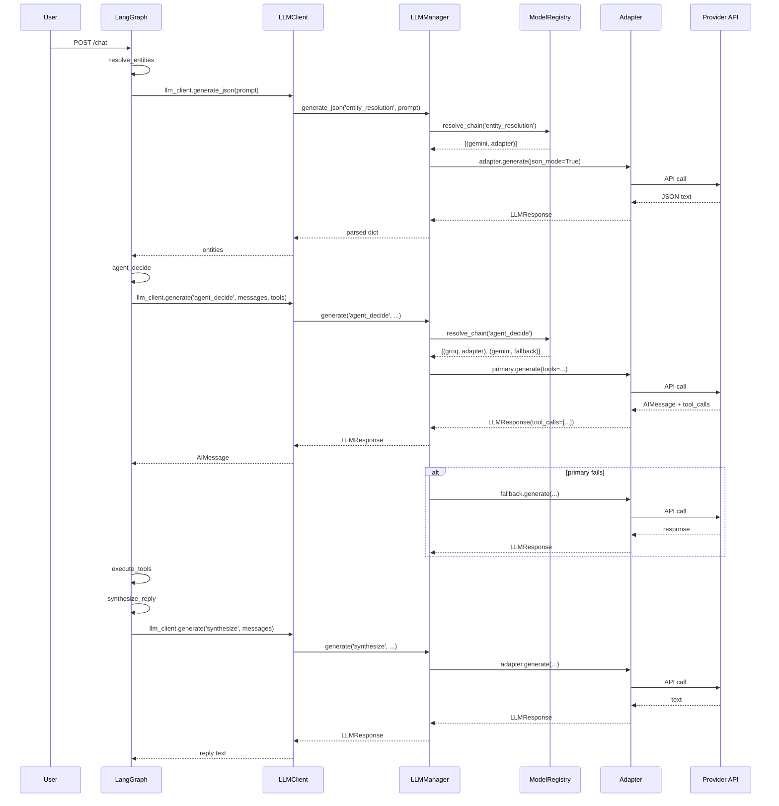
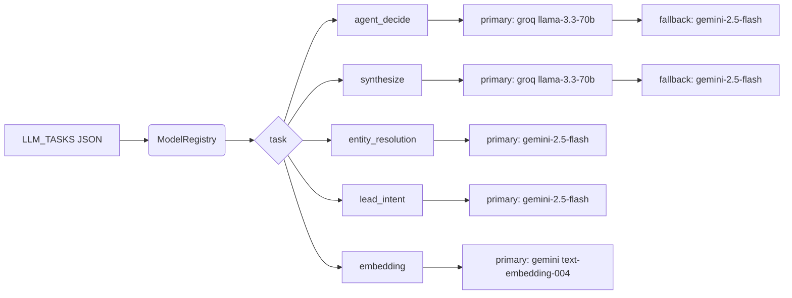

# Phase B Architecture — Unified LLM Layer

## Component Diagram (Mermaid)

```mermaid
flowchart TB
    subgraph Application
        direction TB
        G[agent/graph.py
           LangGraph nodes]
        R[agent/resolve.py
           entity resolution]
        LI[leads/intent.py
           lead classifier]
        OC[observability.py
           metrics]
    end

    subgraph "LLM Facade"
        direction TB
        LC[agent/llm_client.py
           LLMClient]
    end

    subgraph "Unified LLM Layer"
        direction TB
        LM[llm/manager.py
           LLMManager]
        MR[llm/registry.py
           ModelRegistry]
        LF[llm/factory.py
           create_adapter]
        LT[llm/types.py
           protocols + capabilities]
    end

    subgraph "Provider Adapters"
        direction TB
        GA[llm/adapters/groq.py]
        GM[llm/adapters/gemini.py]
        OA[llm/adapters/openai.py]
        OR[llm/adapters/openrouter.py]
        AN[llm/adapters/anthropic.py]
        DS[llm/adapters/deepseek.py]
        KI[llm/adapters/kimi.py]
    end

    subgraph "Vendor SDKs"
        direction TB
        VG[groq / langchain-groq]
        VGM[google-generativeai /
            langchain-google-genai]
        VO[openai / langchain-openai]
        VA[anthropic / langchain-anthropic]
    end

    G -->|generate('agent_decide', ...)| LC
    G -->|generate('synthesize', ...)| LC
    R -->|generate_json() / embed()| LC
    LI -->|generate_json(task='lead_intent')| LC
    LC -->|delegate| LM
    LM -->|resolve_chain(task)| MR
    MR -->|create_adapter(provider, model)| LF
    LF --> GA & GM & OA & OR & AN & DS & KI
    GA --> VG
    GM --> VGM
    OA --> VO
    OR --> VO
    AN --> VA
    DS --> VO
    KI --> VO
    LM -.->|record_llm_call / duration| OC
```

## Call Flow for One Chat Turn



## Registry / Fallback Chain



## Key Design Decisions

1. **Adapter Protocol** — every provider implements `generate`, `stream`, `embed`, and `get_chat_model`.  Capabilities are declared as flags so the registry can skip unsuitable providers.
2. **Task Registry** — tasks (agent_decide, synthesize, entity_resolution, lead_intent, embedding) are configured independently.  Each task has its own provider/model and optional fallback chain.
3. **Fallback Chain** — `LLMManager._execute_with_fallbacks()` retries each provider up to 3× with exponential backoff, then moves to the next configured fallback.
4. **LangGraph Integration** — graph nodes call the unified `generate()` interface and convert the normalized `LLMResponse` back to LangChain `AIMessage` objects so the rest of the LangGraph machinery (ToolNode, add_messages) works unchanged.
5. **Backward Compatibility** — `agent/llm_client.py` keeps the same public methods (`generate_text`, `generate_json`, `chat_model`, `enabled`) so existing callers and tests keep working.
